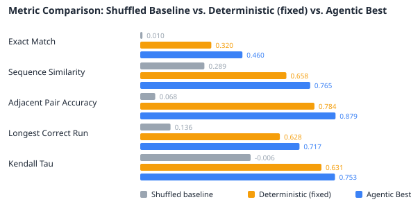

# Agentic Evaluation (E. coli, esm_small, r100)

## How to Read This Report
**Run type: Agentic (single_call).** Each metric compares:

- **Shuffled Baseline** — a random fragment ordering. The floor, not a method.
- **Deterministic (config defaults)** — the non-agentic baseline: iteration 1 run with the fixed `search.default_levers` and **no LLM call**. The agent refines from it.
- **Control (non-LLM)** — the matched-budget control arm: the SAME iteration budget, SAME fixed tool pipeline and SAME best-validity selection as the agentic arm, but the five levers are chosen by a non-LLM policy (random/grid) instead of the LLM, and it runs paired on the same protein with 0 LLM calls. **`Δ Agentic − Control` is the isolated value of the LLM's reasoning** — it separates "the agent reasons well" from "trying several candidates and keeping the best-validity one helps."
- **Agentic Best** — the agent's result: iterations 2+ are LLM lever choices, and the kept candidate is the best-validity one across all iterations (subject to `search.improvement_margin`). Since iteration 1 (the deterministic baseline) is in the candidate set, read the **true-metric** columns for the real "does the agent help?" answer.
- **Oracle (ceiling)** — for each metric, the best value achievable by selecting among the candidates the agent actually generated. Not a method (it peeks at the ground truth); the **Oracle − Agentic** gap is what the imperfect (~57–61%) validity concordance leaves on the table — reachable by better selection alone, no new candidate.

## Run Overview
- Samples evaluated: 100
- Avg junctions pruned: 6.6%
- Exact matches: 46/100
- Result folder: `130726_224804_agentic`
- Total run duration: 1h 11m 56s
- Avg duration per sample: 43s

## Configuration
| Setting | Value |
| --- | --- |
| Run Method | agentic |
| Calling Mode | single_call |
| Device | cuda |
| Seed | 42 |
| Dataset | E. coli |
| Test Samples | 100 |
| Replica Count | 100 |
| Missed Cleavage Ratio | 0.3 |
| MLM Model | facebook/esm2_t6_8M_UR50D |
| MLM Type | esm |
| MLM Batch Size | 64 |
| MLM Max Length | 1024 |
| Beam Width | 25 |
| Junction Window | 1 |
| Validity Model | facebook/esm2_t6_8M_UR50D |
| Max Iterations | 5 |
| Iteration 1 Mode | Deterministic — config defaults (no LLM call) |
| Early Stop Patience | 5 |
| LLM Model | gpt-5-mini |
| LLM Sampling | seed=42, reasoning_effort=low, verbosity=low |

## Benchmark: Shuffled Baseline vs. Deterministic vs. Agentic vs. Control
| Metric | Shuffled Baseline | Deterministic (config defaults, no LLM) | Control (random, no LLM) | Agentic Best (iteratively selected) | Oracle (ceiling) | Δ Agentic − Deterministic | Δ Agentic − Control | Direction |
| --- | --- | --- | --- | --- | --- | --- | --- | --- |
| Exact Match | 0.0100 | 0.3200 | 0.4000 | 0.4600 | 0.6400 | +0.1400 | +0.0600 | better |
| Sequence Similarity | 0.2888 | 0.6577 | 0.7084 | 0.7651 | 0.8516 | +0.1074 | +0.0567 | better |
| Adjacent Pair Accuracy | 0.0676 | 0.7841 | 0.8627 | 0.8791 | 0.9256 | +0.0949 | +0.0164 | better |
| Longest Correct Run | 0.1362 | 0.6283 | 0.6819 | 0.7169 | 0.8195 | +0.0886 | +0.0350 | better |
| Kendall Tau | -0.0064 | 0.6315 | 0.7050 | 0.7532 | 0.8788 | +0.1218 | +0.0482 | better |

### Selection Ceiling (Oracle)
The Oracle column is the best true-metric value reachable by selecting among the candidates the agent already generated (it peeks at ground truth, so it is a ceiling, not a method). The gap below is quality the run left on the table purely to imperfect validity selection — reachable with better selection alone, no new candidate generated. A large gap says the bottleneck is the selection signal, not the search.

| Metric | Agentic Best (iteratively selected) | Oracle (best generated) | Gap (Oracle − Agentic) |
| --- | --- | --- | --- |
| Exact Match | 0.4600 | 0.6400 | +0.1800 |
| Sequence Similarity | 0.7651 | 0.8516 | +0.0865 |
| Adjacent Pair Accuracy | 0.8791 | 0.9256 | +0.0465 |
| Longest Correct Run | 0.7169 | 0.8195 | +0.1026 |
| Kendall Tau | 0.7532 | 0.8788 | +0.1256 |

## Agentic vs. Deterministic (paired, per sample, n=100)
Per-sample gain of the agentic result over the deterministic best-fixed baseline (Agentic − Deterministic on the same protein). Mean is the average improvement; std dev shows how consistently the agent helps vs. swings the other way on individual samples. For a significance claim on n samples, run a paired Wilcoxon signed-rank test on these per-sample gains.

| Metric | Mean Gain | Std Dev | Min Gain | Max Gain |
| --- | --- | --- | --- | --- |
| Exact Match | +0.1400 | 0.3747 | -1.0000 | +1.0000 |
| Sequence Similarity | +0.1074 | 0.2676 | -0.9395 | +0.9532 |
| Adjacent Pair Accuracy | +0.0949 | 0.1508 | -0.3000 | +0.7273 |
| Longest Correct Run | +0.0886 | 0.2312 | -0.8095 | +0.7692 |
| Kendall Tau | +0.1218 | 0.3535 | -1.4095 | +1.2185 |
| Best Validity Score (junction+overlap blend, lower=better) | -1.7931 | 2.2411 | -9.9508 | +0.0000 |

## Agentic vs. Control (paired, matched budget, n=100)
**The isolated value of the LLM's reasoning.** Per-sample gain of the agentic arm over the non-LLM control arm (Agentic − Control on the same protein), where both arms ran the same iteration budget, the same fixed tool pipeline and the same best-validity selection — only the lever *source* differed (LLM vs a random policy). A plain Agentic − Deterministic gain conflates 'the agent reasons well' with 'trying several candidates and keeping the best helps'; this comparison holds the budget and selection fixed, so a positive, consistent gain here is attributable to the LLM. Run a paired Wilcoxon signed-rank test on these per-sample gains for the significance claim.

| Metric | Mean Gain | Std Dev | Min Gain | Max Gain |
| --- | --- | --- | --- | --- |
| Exact Match | +0.0600 | 0.2764 | -1.0000 | +1.0000 |
| Sequence Similarity | +0.0567 | 0.2237 | -0.5816 | +0.9532 |
| Adjacent Pair Accuracy | +0.0164 | 0.0670 | -0.2143 | +0.2800 |
| Longest Correct Run | +0.0350 | 0.1399 | -0.3333 | +0.6400 |
| Kendall Tau | +0.0482 | 0.1897 | -0.2764 | +1.2185 |
| Best Validity Score (lower=better; negative = agentic more plausible) | -0.1798 | 0.9638 | -4.6249 | +2.2402 |

## Distribution Summary (n=100 samples)
The at-a-glance view for larger runs — read this before the per-sample table.

| Metric | Mean | Std Dev | Min | Median | Max |
| --- | --- | --- | --- | --- | --- |
| Exact Match | 0.4600 | 0.4984 | 0.0000 | 0.0000 | 1.0000 |
| Sequence Similarity | 0.7651 | 0.3131 | 0.0034 | 0.9943 | 1.0000 |
| Adjacent Pair Accuracy | 0.8791 | 0.1461 | 0.0000 | 0.8856 | 1.0000 |
| Longest Correct Run | 0.7169 | 0.2891 | 0.1905 | 0.7889 | 1.0000 |
| Kendall Tau | 0.7532 | 0.3319 | -0.4095 | 0.9365 | 1.0000 |
| Best Validity Score (junction+overlap blend, lower=better) | 10.9920 | 6.4710 | 1.0000 | 13.5030 | 21.0880 |

## Validity Signal Concordance
Whether the validity score used to *select* the winning candidate actually tracks true reconstruction quality, measured within each sample across the iterations it tried. 0.50 = no better than chance at picking the better of two candidates; higher is better. This is the trust check for the selection signal — if it is near 0.50, a better candidate the agent generated would not reliably be the one kept.

| Quality metric compared against | Concordance | Comparable pairs |
| --- | --- | --- |
| Kendall Tau | 0.700 | 95142 |
| Adjacent Pair Accuracy | 0.706 | 94246 |

## Cost, Efficiency & Completion
The non-quality axis the agentic approach must also justify itself on: LLM calls, tokens, wall-clock, and how often it produced a usable result.

| Measure | Value |
| --- | --- |
| Samples | 100 |
| Completed (clean permutation produced) | 100/100 |
| True order recoverable (ordering metrics valid) | 100/100 |
| LLM lever-choice failures (fell back to defaults) | 0 |
| Total LLM calls | 400 |
| Avg LLM calls / sample | 4.00 |
| Total LLM tokens | 613053 |
| Avg LLM tokens / sample | 6131 |
| Avg wall-clock / sample (total) | 43s |
| — Matched-budget control arm (no LLM) — |  |
| Control lever policy | random |
| Control LLM calls | 0 |
| Avg wall-clock / sample — agentic arm | 35s |
| Avg wall-clock / sample — control arm | 7s |

## Per-Sample Results (showing first 15 and last 5 of 100; full table in `samples.jsonl`)
| Sample | Exact Match | Best Validity Score | Best Iteration | Fragments Placed | Junctions Pruned | Confirmed Adjacencies | Duration |
| --- | --- | --- | --- | --- | --- | --- | --- |
| 1 | yes | 2.6144 | 1 | 11 | 9.1% | 9 | 35s |
| 2 | no | 15.0325 | 1 | 11 | 9.1% | 9 | 36s |
| 3 | yes | 1.0000 | 1 | 7 | 14.3% | 6 | 26s |
| 4 | no | 9.8647 | 1 | 15 | 6.7% | 14 | 34s |
| 5 | no | 15.5789 | 2 | 17 | 5.9% | 17 | 27s |
| 6 | no | 14.8730 | 2 | 51 | 2.0% | 49 | 2m 4s |
| 7 | no | 17.6995 | 2 | 30 | 3.3% | 29 | 42s |
| 8 | no | 17.9552 | 2 | 16 | 6.2% | 16 | 32s |
| 9 | yes | 14.3427 | 1 | 12 | 8.3% | 10 | 35s |
| 10 | no | 16.1108 | 1 | 11 | 9.1% | 10 | 35s |
| 11 | no | 16.6773 | 5 | 42 | 2.4% | 37 | 1m 20s |
| 12 | yes | 1.0000 | 1 | 9 | 11.1% | 8 | 33s |
| 13 | yes | 1.0000 | 1 | 10 | 10.0% | 9 | 32s |
| 14 | yes | 1.0000 | 1 | 8 | 12.5% | 7 | 33s |
| 15 | yes | 1.0000 | 1 | 4 | 25.0% | 3 | 27s |
| 96 | yes | 16.2004 | 2 | 22 | 4.5% | 19 | 30s |
| 97 | no | 15.9210 | 2 | 9 | 11.1% | 6 | 28s |
| 98 | no | 15.7348 | 1 | 17 | 5.9% | 15 | 28s |
| 99 | no | 14.1905 | 4 | 22 | 4.5% | 20 | 35s |
| 100 | yes | 17.8934 | 2 | 7 | 0.0% | 4 | 35s |

## Quick Read
- Higher is better for every metric in the current set.
- Metrics: Exact Match (binary floor); Sequence Similarity (the one soft string metric); Adjacent Pair Accuracy (fraction of true fragment adjacencies preserved, the primary ordering metric); Longest Correct Run (longest contiguous correctly-ordered block, partial-assembly credit); Kendall Tau (global ordering correlation, 0 = random, 1 = perfect, -1 = reversed).
- Ordering metrics are NaN (skipped in the averages) for any sample whose fragments do not tile the target; the count of usable samples is in Cost, Efficiency & Completion.
- A positive delta means the reconstruction improved over the shuffled baseline.
- Each entry in samples.jsonl includes iteration_history with per-iteration lever_values and changed_levers for auditability.
- The validity score is the junction+overlap blended plausibility signal (lower = better); it measures plausibility, not exact-match correctness. Its trustworthiness is quantified in Validity Signal Concordance above.
- Junction-scorer ranking quality is measured separately and search-independently via `python -m evaluation.junction_ranking`.
- Use this report for side-by-side benchmarking; the raw per-sample data is in `samples.jsonl`.
