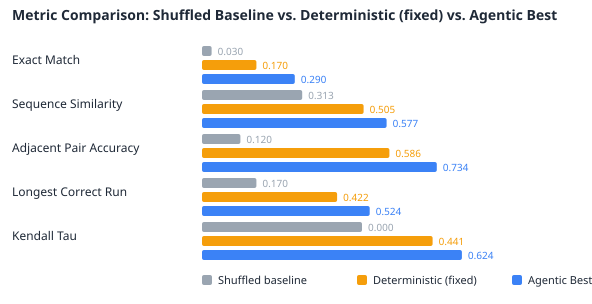

# Agentic Evaluation (E. coli, esm_small, r20)

## How to Read This Report
**Run type: Agentic (single_call).** Each metric compares:

- **Shuffled Baseline** — a random fragment ordering. The floor, not a method.
- **Deterministic (config defaults)** — the non-agentic baseline: iteration 1 run with the fixed `search.default_levers` and **no LLM call**. The agent refines from it.
- **Control (non-LLM)** — the matched-budget control arm: the SAME iteration budget, SAME fixed tool pipeline and SAME best-validity selection as the agentic arm, but the five levers are chosen by a non-LLM policy (random/grid) instead of the LLM, and it runs paired on the same protein with 0 LLM calls. **`Δ Agentic − Control` is the isolated value of the LLM's reasoning** — it separates "the agent reasons well" from "trying several candidates and keeping the best-validity one helps."
- **Agentic Best** — the agent's result: iterations 2+ are LLM lever choices, and the kept candidate is the best-validity one across all iterations (subject to `search.improvement_margin`). Since iteration 1 (the deterministic baseline) is in the candidate set, read the **true-metric** columns for the real "does the agent help?" answer.
- **Oracle (ceiling)** — for each metric, the best value achievable by selecting among the candidates the agent actually generated. Not a method (it peeks at the ground truth); the **Oracle − Agentic** gap is what the imperfect (~57–61%) validity concordance leaves on the table — reachable by better selection alone, no new candidate.

## Run Overview
- Samples evaluated: 100
- Avg junctions pruned: 7.6%
- Exact matches: 29/100
- Result folder: `140726_132208_agentic`
- Total run duration: 1h 23m 26s
- Avg duration per sample: 50s

## Configuration
| Setting | Value |
| --- | --- |
| Run Method | agentic |
| Calling Mode | single_call |
| Device | cuda |
| Seed | 42 |
| Dataset | E. coli |
| Test Samples | 100 |
| Replica Count | 20 |
| Missed Cleavage Ratio | 0.3 |
| MLM Model | facebook/esm2_t6_8M_UR50D |
| MLM Type | esm |
| MLM Batch Size | 64 |
| MLM Max Length | 1024 |
| Beam Width | 25 |
| Junction Window | 1 |
| Validity Model | facebook/esm2_t6_8M_UR50D |
| Max Iterations | 5 |
| Iteration 1 Mode | Deterministic — config defaults (no LLM call) |
| Early Stop Patience | 5 |
| LLM Model | gpt-5-mini |
| LLM Sampling | seed=42, reasoning_effort=low, verbosity=low |

## Benchmark: Shuffled Baseline vs. Deterministic vs. Agentic vs. Control
| Metric | Shuffled Baseline | Deterministic (config defaults, no LLM) | Control (random, no LLM) | Agentic Best (iteratively selected) | Oracle (ceiling) | Δ Agentic − Deterministic | Δ Agentic − Control | Direction |
| --- | --- | --- | --- | --- | --- | --- | --- | --- |
| Exact Match | 0.0300 | 0.1700 | 0.2700 | 0.2900 | 0.3700 | +0.1200 | +0.0200 | better |
| Sequence Similarity | 0.3132 | 0.5051 | 0.5943 | 0.5768 | 0.6441 | +0.0717 | -0.0175 | better |
| Adjacent Pair Accuracy | 0.1199 | 0.5856 | 0.7100 | 0.7338 | 0.7826 | +0.1483 | +0.0239 | better |
| Longest Correct Run | 0.1701 | 0.4222 | 0.5021 | 0.5240 | 0.5821 | +0.1017 | +0.0219 | better |
| Kendall Tau | 0.0003 | 0.4414 | 0.5890 | 0.6242 | 0.7240 | +0.1828 | +0.0352 | better |

### Selection Ceiling (Oracle)
The Oracle column is the best true-metric value reachable by selecting among the candidates the agent already generated (it peeks at ground truth, so it is a ceiling, not a method). The gap below is quality the run left on the table purely to imperfect validity selection — reachable with better selection alone, no new candidate generated. A large gap says the bottleneck is the selection signal, not the search.

| Metric | Agentic Best (iteratively selected) | Oracle (best generated) | Gap (Oracle − Agentic) |
| --- | --- | --- | --- |
| Exact Match | 0.2900 | 0.3700 | +0.0800 |
| Sequence Similarity | 0.5768 | 0.6441 | +0.0673 |
| Adjacent Pair Accuracy | 0.7338 | 0.7826 | +0.0488 |
| Longest Correct Run | 0.5240 | 0.5821 | +0.0582 |
| Kendall Tau | 0.6242 | 0.7240 | +0.0997 |

## Agentic vs. Deterministic (paired, per sample, n=100)
Per-sample gain of the agentic result over the deterministic best-fixed baseline (Agentic − Deterministic on the same protein). Mean is the average improvement; std dev shows how consistently the agent helps vs. swings the other way on individual samples. For a significance claim on n samples, run a paired Wilcoxon signed-rank test on these per-sample gains.

| Metric | Mean Gain | Std Dev | Min Gain | Max Gain |
| --- | --- | --- | --- | --- |
| Exact Match | +0.1200 | 0.3544 | -1.0000 | +1.0000 |
| Sequence Similarity | +0.0717 | 0.1916 | -0.4050 | +0.8871 |
| Adjacent Pair Accuracy | +0.1483 | 0.1665 | -0.3333 | +0.7500 |
| Longest Correct Run | +0.1017 | 0.2074 | -0.5714 | +0.8148 |
| Kendall Tau | +0.1828 | 0.2970 | -0.3137 | +1.1818 |
| Best Validity Score (junction+overlap blend, lower=better) | -3.3908 | 3.5766 | -17.8420 | +0.0000 |

## Agentic vs. Control (paired, matched budget, n=100)
**The isolated value of the LLM's reasoning.** Per-sample gain of the agentic arm over the non-LLM control arm (Agentic − Control on the same protein), where both arms ran the same iteration budget, the same fixed tool pipeline and the same best-validity selection — only the lever *source* differed (LLM vs a random policy). A plain Agentic − Deterministic gain conflates 'the agent reasons well' with 'trying several candidates and keeping the best helps'; this comparison holds the budget and selection fixed, so a positive, consistent gain here is attributable to the LLM. Run a paired Wilcoxon signed-rank test on these per-sample gains for the significance claim.

| Metric | Mean Gain | Std Dev | Min Gain | Max Gain |
| --- | --- | --- | --- | --- |
| Exact Match | +0.0200 | 0.1990 | -1.0000 | +1.0000 |
| Sequence Similarity | -0.0175 | 0.1426 | -0.7022 | +0.8871 |
| Adjacent Pair Accuracy | +0.0239 | 0.0774 | -0.2500 | +0.4286 |
| Longest Correct Run | +0.0219 | 0.1060 | -0.2222 | +0.6250 |
| Kendall Tau | +0.0352 | 0.1622 | -0.4190 | +0.7190 |
| Best Validity Score (lower=better; negative = agentic more plausible) | -0.2969 | 0.7534 | -4.4648 | +1.1747 |

## Distribution Summary (n=100 samples)
The at-a-glance view for larger runs — read this before the per-sample table.

| Metric | Mean | Std Dev | Min | Median | Max |
| --- | --- | --- | --- | --- | --- |
| Exact Match | 0.2900 | 0.4538 | 0.0000 | 0.0000 | 1.0000 |
| Sequence Similarity | 0.5768 | 0.3757 | 0.0042 | 0.6360 | 1.0000 |
| Adjacent Pair Accuracy | 0.7338 | 0.2034 | 0.3000 | 0.7143 | 1.0000 |
| Longest Correct Run | 0.5240 | 0.3334 | 0.0841 | 0.3798 | 1.0000 |
| Kendall Tau | 0.6242 | 0.3229 | -0.0310 | 0.6893 | 1.0000 |
| Best Validity Score (junction+overlap blend, lower=better) | 13.5059 | 5.0132 | 1.0000 | 14.5720 | 24.6833 |

## Validity Signal Concordance
Whether the validity score used to *select* the winning candidate actually tracks true reconstruction quality, measured within each sample across the iterations it tried. 0.50 = no better than chance at picking the better of two candidates; higher is better. This is the trust check for the selection signal — if it is near 0.50, a better candidate the agent generated would not reliably be the one kept.

| Quality metric compared against | Concordance | Comparable pairs |
| --- | --- | --- |
| Kendall Tau | 0.659 | 115360 |
| Adjacent Pair Accuracy | 0.716 | 114605 |

## Cost, Efficiency & Completion
The non-quality axis the agentic approach must also justify itself on: LLM calls, tokens, wall-clock, and how often it produced a usable result.

| Measure | Value |
| --- | --- |
| Samples | 100 |
| Completed (clean permutation produced) | 100/100 |
| True order recoverable (ordering metrics valid) | 100/100 |
| LLM lever-choice failures (fell back to defaults) | 0 |
| Total LLM calls | 400 |
| Avg LLM calls / sample | 4.00 |
| Total LLM tokens | 604473 |
| Avg LLM tokens / sample | 6045 |
| Avg wall-clock / sample (total) | 50s |
| — Matched-budget control arm (no LLM) — |  |
| Control lever policy | random |
| Control LLM calls | 0 |
| Avg wall-clock / sample — agentic arm | 42s |
| Avg wall-clock / sample — control arm | 7s |

## Per-Sample Results (showing first 15 and last 5 of 100; full table in `samples.jsonl`)
| Sample | Exact Match | Best Validity Score | Best Iteration | Fragments Placed | Junctions Pruned | Confirmed Adjacencies | Duration |
| --- | --- | --- | --- | --- | --- | --- | --- |
| 1 | no | 13.5845 | 2 | 9 | 11.1% | 2 | 40s |
| 2 | no | 13.4831 | 1 | 8 | 12.5% | 5 | 36s |
| 3 | yes | 1.0000 | 1 | 7 | 14.3% | 6 | 37s |
| 4 | no | 7.6945 | 1 | 16 | 6.2% | 11 | 38s |
| 5 | no | 13.5102 | 2 | 17 | 5.9% | 12 | 40s |
| 6 | no | 14.6868 | 3 | 52 | 1.9% | 39 | 1m 44s |
| 7 | no | 14.9752 | 2 | 26 | 3.8% | 13 | 49s |
| 8 | no | 17.7673 | 5 | 18 | 5.6% | 11 | 38s |
| 9 | no | 12.9165 | 3 | 11 | 9.1% | 6 | 33s |
| 10 | yes | 10.6024 | 1 | 7 | 14.3% | 4 | 38s |
| 11 | no | 18.4148 | 3 | 54 | 1.9% | 41 | 1m 40s |
| 12 | yes | 1.0000 | 1 | 9 | 11.1% | 8 | 33s |
| 13 | no | 15.2184 | 2 | 6 | 16.7% | 3 | 32s |
| 14 | no | 22.1355 | 1 | 9 | 11.1% | 7 | 35s |
| 15 | yes | 1.0000 | 1 | 2 | 50.0% | 1 | 34s |
| 96 | no | 19.0036 | 3 | 24 | 4.2% | 18 | 43s |
| 97 | no | 17.5255 | 1 | 11 | 9.1% | 7 | 32s |
| 98 | no | 18.2245 | 2 | 18 | 5.6% | 13 | 37s |
| 99 | no | 12.9358 | 4 | 13 | 7.7% | 5 | 40s |
| 100 | yes | 14.0865 | 2 | 9 | 0.0% | 4 | 32s |

## Quick Read
- Higher is better for every metric in the current set.
- Metrics: Exact Match (binary floor); Sequence Similarity (the one soft string metric); Adjacent Pair Accuracy (fraction of true fragment adjacencies preserved, the primary ordering metric); Longest Correct Run (longest contiguous correctly-ordered block, partial-assembly credit); Kendall Tau (global ordering correlation, 0 = random, 1 = perfect, -1 = reversed).
- Ordering metrics are NaN (skipped in the averages) for any sample whose fragments do not tile the target; the count of usable samples is in Cost, Efficiency & Completion.
- A positive delta means the reconstruction improved over the shuffled baseline.
- Each entry in samples.jsonl includes iteration_history with per-iteration lever_values and changed_levers for auditability.
- The validity score is the junction+overlap blended plausibility signal (lower = better); it measures plausibility, not exact-match correctness. Its trustworthiness is quantified in Validity Signal Concordance above.
- Junction-scorer ranking quality is measured separately and search-independently via `python -m evaluation.junction_ranking`.
- Use this report for side-by-side benchmarking; the raw per-sample data is in `samples.jsonl`.
