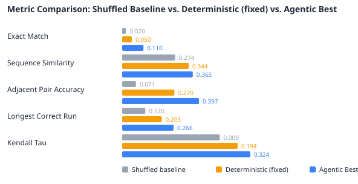

# Agentic Evaluation (Yeast, esm_small, r5)

## How to Read This Report
**Run type: Agentic (single_call).** Each metric compares:

- **Shuffled Baseline** — a random fragment ordering. The floor, not a method.
- **Deterministic (config defaults)** — the non-agentic baseline: iteration 1 run with the fixed `search.default_levers` and **no LLM call**. The agent refines from it.
- **Control (non-LLM)** — the matched-budget control arm: the SAME iteration budget, SAME fixed tool pipeline and SAME best-validity selection as the agentic arm, but the five levers are chosen by a non-LLM policy (random/grid) instead of the LLM, and it runs paired on the same protein with 0 LLM calls. **`Δ Agentic − Control` is the isolated value of the LLM's reasoning** — it separates "the agent reasons well" from "trying several candidates and keeping the best-validity one helps."
- **Agentic Best** — the agent's result: iterations 2+ are LLM lever choices, and the kept candidate is the best-validity one across all iterations (subject to `search.improvement_margin`). Since iteration 1 (the deterministic baseline) is in the candidate set, read the **true-metric** columns for the real "does the agent help?" answer.
- **Oracle (ceiling)** — for each metric, the best value achievable by selecting among the candidates the agent actually generated. Not a method (it peeks at the ground truth); the **Oracle − Agentic** gap is what the imperfect (~57–61%) validity concordance leaves on the table — reachable by better selection alone, no new candidate.

## Run Overview
- Samples evaluated: 100
- Avg junctions pruned: 6.3%
- Exact matches: 11/100
- Result folder: `140726_215821_agentic`
- Total run duration: 1h 58m 22s
- Avg duration per sample: 1m 11s

## Configuration
| Setting | Value |
| --- | --- |
| Run Method | agentic |
| Calling Mode | single_call |
| Device | cuda |
| Seed | 42 |
| Dataset | Yeast |
| Test Samples | 100 |
| Replica Count | 5 |
| Missed Cleavage Ratio | 0.3 |
| MLM Model | facebook/esm2_t6_8M_UR50D |
| MLM Type | esm |
| MLM Batch Size | 64 |
| MLM Max Length | 1024 |
| Beam Width | 25 |
| Junction Window | 1 |
| Validity Model | facebook/esm2_t6_8M_UR50D |
| Max Iterations | 5 |
| Iteration 1 Mode | Deterministic — config defaults (no LLM call) |
| Early Stop Patience | 5 |
| LLM Model | gpt-5-mini |
| LLM Sampling | seed=42, reasoning_effort=low, verbosity=low |

## Benchmark: Shuffled Baseline vs. Deterministic vs. Agentic vs. Control
| Metric | Shuffled Baseline | Deterministic (config defaults, no LLM) | Control (random, no LLM) | Agentic Best (iteratively selected) | Oracle (ceiling) | Δ Agentic − Deterministic | Δ Agentic − Control | Direction |
| --- | --- | --- | --- | --- | --- | --- | --- | --- |
| Exact Match | 0.0200 | 0.0500 | 0.1000 | 0.1100 | 0.1400 | +0.0600 | +0.0100 | better |
| Sequence Similarity | 0.2737 | 0.3437 | 0.3550 | 0.3651 | 0.4248 | +0.0214 | +0.0101 | better |
| Adjacent Pair Accuracy | 0.0712 | 0.2700 | 0.3840 | 0.3972 | 0.4493 | +0.1272 | +0.0132 | better |
| Longest Correct Run | 0.1198 | 0.2047 | 0.2522 | 0.2656 | 0.3070 | +0.0609 | +0.0134 | better |
| Kendall Tau | 0.0090 | 0.1936 | 0.3100 | 0.3243 | 0.4363 | +0.1308 | +0.0143 | better |

### Selection Ceiling (Oracle)
The Oracle column is the best true-metric value reachable by selecting among the candidates the agent already generated (it peeks at ground truth, so it is a ceiling, not a method). The gap below is quality the run left on the table purely to imperfect validity selection — reachable with better selection alone, no new candidate generated. A large gap says the bottleneck is the selection signal, not the search.

| Metric | Agentic Best (iteratively selected) | Oracle (best generated) | Gap (Oracle − Agentic) |
| --- | --- | --- | --- |
| Exact Match | 0.1100 | 0.1400 | +0.0300 |
| Sequence Similarity | 0.3651 | 0.4248 | +0.0597 |
| Adjacent Pair Accuracy | 0.3972 | 0.4493 | +0.0521 |
| Longest Correct Run | 0.2656 | 0.3070 | +0.0415 |
| Kendall Tau | 0.3243 | 0.4363 | +0.1120 |

## Agentic vs. Deterministic (paired, per sample, n=100)
Per-sample gain of the agentic result over the deterministic best-fixed baseline (Agentic − Deterministic on the same protein). Mean is the average improvement; std dev shows how consistently the agent helps vs. swings the other way on individual samples. For a significance claim on n samples, run a paired Wilcoxon signed-rank test on these per-sample gains.

| Metric | Mean Gain | Std Dev | Min Gain | Max Gain |
| --- | --- | --- | --- | --- |
| Exact Match | +0.0600 | 0.2764 | -1.0000 | +1.0000 |
| Sequence Similarity | +0.0214 | 0.1277 | -0.4407 | +0.4211 |
| Adjacent Pair Accuracy | +0.1272 | 0.1699 | -0.2500 | +0.7500 |
| Longest Correct Run | +0.0609 | 0.1631 | -0.5556 | +0.7273 |
| Kendall Tau | +0.1308 | 0.2898 | -0.5333 | +1.1273 |
| Best Validity Score (junction+overlap blend, lower=better) | -3.9116 | 2.5901 | -12.1397 | +0.0000 |

## Agentic vs. Control (paired, matched budget, n=100)
**The isolated value of the LLM's reasoning.** Per-sample gain of the agentic arm over the non-LLM control arm (Agentic − Control on the same protein), where both arms ran the same iteration budget, the same fixed tool pipeline and the same best-validity selection — only the lever *source* differed (LLM vs a random policy). A plain Agentic − Deterministic gain conflates 'the agent reasons well' with 'trying several candidates and keeping the best helps'; this comparison holds the budget and selection fixed, so a positive, consistent gain here is attributable to the LLM. Run a paired Wilcoxon signed-rank test on these per-sample gains for the significance claim.

| Metric | Mean Gain | Std Dev | Min Gain | Max Gain |
| --- | --- | --- | --- | --- |
| Exact Match | +0.0100 | 0.0995 | +0.0000 | +1.0000 |
| Sequence Similarity | +0.0101 | 0.0754 | -0.3065 | +0.4015 |
| Adjacent Pair Accuracy | +0.0132 | 0.0777 | -0.1429 | +0.4000 |
| Longest Correct Run | +0.0134 | 0.0928 | -0.2000 | +0.7273 |
| Kendall Tau | +0.0143 | 0.1506 | -0.5000 | +0.7111 |
| Best Validity Score (lower=better; negative = agentic more plausible) | -0.4563 | 1.1970 | -6.7990 | +2.7035 |

## Distribution Summary (n=100 samples)
The at-a-glance view for larger runs — read this before the per-sample table.

| Metric | Mean | Std Dev | Min | Median | Max |
| --- | --- | --- | --- | --- | --- |
| Exact Match | 0.1100 | 0.3129 | 0.0000 | 0.0000 | 1.0000 |
| Sequence Similarity | 0.3651 | 0.3704 | 0.0006 | 0.1880 | 1.0000 |
| Adjacent Pair Accuracy | 0.3972 | 0.2520 | 0.0000 | 0.3215 | 1.0000 |
| Longest Correct Run | 0.2656 | 0.2860 | 0.0286 | 0.1429 | 1.0000 |
| Kendall Tau | 0.3243 | 0.3420 | -0.3620 | 0.2048 | 1.0000 |
| Best Validity Score (junction+overlap blend, lower=better) | 16.3144 | 2.1157 | 9.9112 | 16.3515 | 22.7563 |

## Validity Signal Concordance
Whether the validity score used to *select* the winning candidate actually tracks true reconstruction quality, measured within each sample across the iterations it tried. 0.50 = no better than chance at picking the better of two candidates; higher is better. This is the trust check for the selection signal — if it is near 0.50, a better candidate the agent generated would not reliably be the one kept.

| Quality metric compared against | Concordance | Comparable pairs |
| --- | --- | --- |
| Kendall Tau | 0.592 | 123285 |
| Adjacent Pair Accuracy | 0.666 | 122753 |

## Cost, Efficiency & Completion
The non-quality axis the agentic approach must also justify itself on: LLM calls, tokens, wall-clock, and how often it produced a usable result.

| Measure | Value |
| --- | --- |
| Samples | 100 |
| Completed (clean permutation produced) | 100/100 |
| True order recoverable (ordering metrics valid) | 100/100 |
| LLM lever-choice failures (fell back to defaults) | 0 |
| Total LLM calls | 400 |
| Avg LLM calls / sample | 4.00 |
| Total LLM tokens | 589057 |
| Avg LLM tokens / sample | 5891 |
| Avg wall-clock / sample (total) | 1m 11s |
| — Matched-budget control arm (no LLM) — |  |
| Control lever policy | random |
| Control LLM calls | 0 |
| Avg wall-clock / sample — agentic arm | 54s |
| Avg wall-clock / sample — control arm | 15s |

## Per-Sample Results (showing first 15 and last 5 of 100; full table in `samples.jsonl`)
| Sample | Exact Match | Best Validity Score | Best Iteration | Fragments Placed | Junctions Pruned | Confirmed Adjacencies | Duration |
| --- | --- | --- | --- | --- | --- | --- | --- |
| 1 | no | 17.5890 | 5 | 33 | 3.0% | 14 | 53s |
| 2 | no | 16.2102 | 5 | 68 | 1.5% | 25 | 2m 40s |
| 3 | no | 17.6797 | 3 | 49 | 2.0% | 16 | 1m 15s |
| 4 | no | 11.9577 | 3 | 14 | 0.0% | 7 | 33s |
| 5 | yes | 14.6458 | 2 | 5 | 20.0% | 2 | 27s |
| 6 | yes | 19.7987 | 2 | 4 | 25.0% | 1 | 28s |
| 7 | no | 18.0603 | 4 | 74 | 0.0% | 31 | 2m 16s |
| 8 | no | 14.5028 | 3 | 10 | 10.0% | 4 | 30s |
| 9 | no | 14.2907 | 4 | 20 | 5.0% | 8 | 42s |
| 10 | no | 17.0875 | 5 | 52 | 1.9% | 15 | 1m 32s |
| 11 | yes | 13.4655 | 1 | 5 | 20.0% | 2 | 26s |
| 12 | yes | 18.2355 | 1 | 2 | 50.0% | 0 | 28s |
| 13 | no | 12.1403 | 2 | 7 | 0.0% | 1 | 25s |
| 14 | yes | 12.4232 | 1 | 6 | 16.7% | 1 | 26s |
| 15 | no | 16.1093 | 3 | 20 | 5.0% | 6 | 36s |
| 96 | no | 14.5697 | 2 | 21 | 4.8% | 10 | 46s |
| 97 | no | 15.3898 | 4 | 68 | 1.5% | 26 | 2m 18s |
| 98 | no | 13.0111 | 3 | 18 | 5.6% | 6 | 30s |
| 99 | no | 18.8935 | 2 | 86 | 1.2% | 29 | 2m 45s |
| 100 | no | 18.5197 | 4 | 33 | 0.0% | 14 | 1m 6s |

## Quick Read
- Higher is better for every metric in the current set.
- Metrics: Exact Match (binary floor); Sequence Similarity (the one soft string metric); Adjacent Pair Accuracy (fraction of true fragment adjacencies preserved, the primary ordering metric); Longest Correct Run (longest contiguous correctly-ordered block, partial-assembly credit); Kendall Tau (global ordering correlation, 0 = random, 1 = perfect, -1 = reversed).
- Ordering metrics are NaN (skipped in the averages) for any sample whose fragments do not tile the target; the count of usable samples is in Cost, Efficiency & Completion.
- A positive delta means the reconstruction improved over the shuffled baseline.
- Each entry in samples.jsonl includes iteration_history with per-iteration lever_values and changed_levers for auditability.
- The validity score is the junction+overlap blended plausibility signal (lower = better); it measures plausibility, not exact-match correctness. Its trustworthiness is quantified in Validity Signal Concordance above.
- Junction-scorer ranking quality is measured separately and search-independently via `python -m evaluation.junction_ranking`.
- Use this report for side-by-side benchmarking; the raw per-sample data is in `samples.jsonl`.
